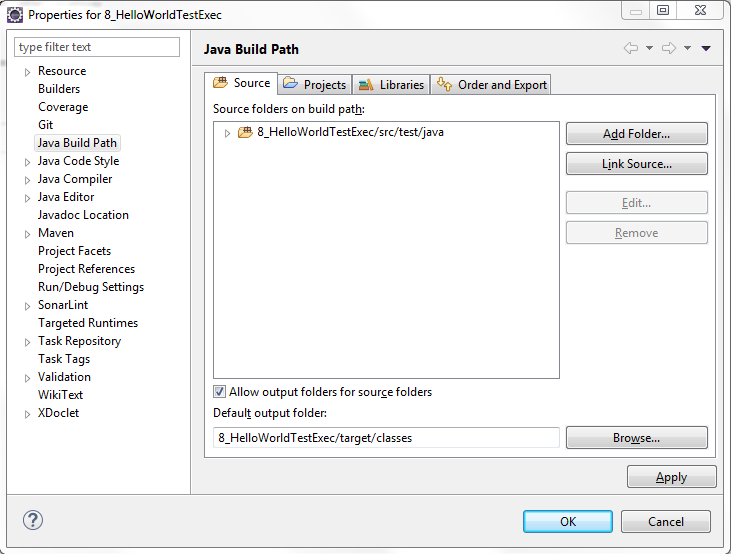

# Der HelloWorldWebService

Die Quellen in diesem Repository stammen nicht von mir, sondern von meinem Kollegen Reik Oberrath. Ich stelle sie hier nur zur Verfügung. 

Absicht der Realisierung dieser Model-Implementierung eines Webservices ist

1. das Sustainable Service Design (SSD von Wolfgang Pleus) zu veranschaulichen
2. die Bedeutung von Testbarkeit, insbesondere ihre Granularität und Detailierungsgrade (im IKS-Vortrag „Zwiebelschalen“ genannt), für die Teststrategie zu veranschaulichen

Es existiert eine Java-Implementierung mit folgenden Komponenten:

Die Implementierung liegt in Form Workspaces vor, der in eine IDE wie Eclipse als Maven-Projekte importiert werden kann. Systemvorausetztungen sind:

1. IDE (empfohlen Eclipse 4.5)
2. Java (empfohlen 1.7 – siehe Eclipse-Windows-Preferences-Java-Installed JRE)
3. Maven (empfohlen 3.3.3, siehe Eclipse-Windows-Preferences-Maven-Installations)
4. Tomcat (empfohlen v8.0) als Laufzeitumgebung der deployten war-files

## Deployment der war-files

In dem HelloWorldWebService-Workspace finden sich folgende Projekte:

In den Projekten mit den Nummern 0, 2, 5 und 9 finden sich bat-files mit Namen copyToTomcatDir.bat und/oder buildAndDeploy.bat, die es ermöglichen in einem Schritt die jeweiligen war-files zu bauen und zu deployen. In den Copy-Bat-Files muss allerdings erst die Variable tomcatHome korrekt gesetzt werden!

## Ausführung der Tests

Das Projekt 0_HelloWorldServiceParent enthält eine Implementierung, um alle ClassLevel-Tests in den Projekten Api  (1),  Impl (3) und SmallTalkCommentProvider (4) auszuführen. Damit das klappt ist leider etwas Konfigurationsaufwand nötig:

* Nach dem Import ist das Parent-Projekt kein Java-Projekt. In Eclipse kann man das ändern, in dem in den Projekt-Properties die Facetten aktiviert werden:

* Anschließend muss das Parent-Projekt die Abhängigkeit zu JUnit auflösen können. Dazu in den Projekt-Properties Java Build Path – Libraries – Add Library auswählen:

* Jetzt muss noch der Default Output Folder auf target/classes gesetzt werden. Wieder in den Projekt-Properties unter Java Build Path:

* Jetzt muss der Classpath des Parent-Projekt noch die anderen Projekte mit Testklassen kennenlernen. Das geht ebenfalls über Projekt-Properties und Java Build Path:

Führt man jetzt für das Parent-Projekt die JUnit-Tests aus, werden die 15 ClassLevel-Tests des HelloWorldService ausgeführt.

Macht man das gleiche für das Projekt 6_HelloWorldComponentIntegrationTest und 8_HelloWorldSystemTest (dazu muss dann der Tomcat mit den deployten war-files laufen) werden die Integrationstests auf Komponenten-Level bzw. die Systemtests ausgeführt.
